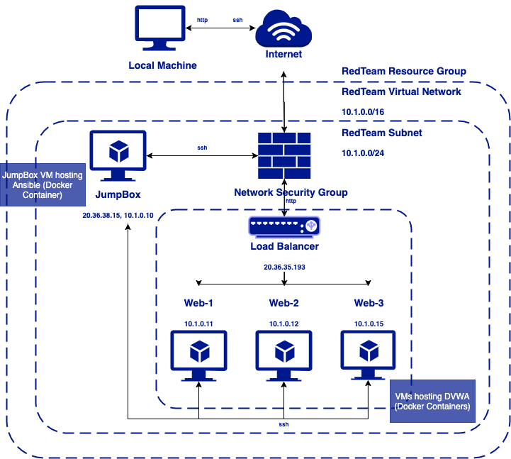
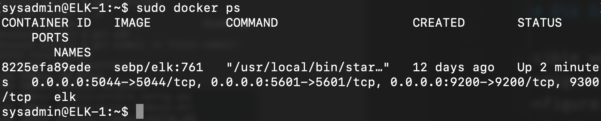

## Automated ELK Stack Deployment

The files in this repository were used to configure the network depicted below.

These files have been tested and used to generate a live ELK deployment on Azure. They can be used to either recreate the entire deployment pictured above. Alternatively, select portions of the install-elk.yml file may be used to install only certain pieces of it, such as Filebeat.

This document contains the following details:
- Description of the Topology
- Access Policies
- ELK Configuration
  - Beats in Use
  - Machines Being Monitored
- How to Use the Ansible Build

### Description of the Topology

The main purpose of this network is to expose a load-balanced and monitored instance of DVWA, the D*mn Vulnerable Web Application.

Load balancing ensures that the application will be highly redundant, in addition to restricting access to the network.

Integrating an ELK server allows users to easily monitor the vulnerable VMs for changes to the logs and system traffic.

The configuration details of each machine may be found below.

| Name    | Function | IP Address | Operating System |
|---------|----------|------------|------------------|
| JumpBox | Gateway  | 10.1.0.10  | Linux            |
| Web-1   | Server   | 10.1.0.11  | Linux            |
| Web-2   | Server   | 10.1.0.12  | Linux            |
| Web-3   | Server   | 10.1.0.15  | Linux            |
| ELK-1   | Monitor  | 10.2.0.5   | Linux            |

### Access Policies

The machines on the internal network are not exposed to the public Internet. 

Only the JumpBox machine can accept connections from the Internet. Access to this machine is only allowed from the following IP addresses:
- 58.178.221.132

Machines within the network can only be accessed by JumpBox.
- 10.1.0.10

A summary of the access policies in place can be found in the table below.

| Name    | Publicly Accessible | Allowed IP Addresses |
|---------|---------------------|----------------------|
| JumpBox | Yes                 | 58.178.221.132       |
| Web-1   | No                  | 10.1.0.10            |
| Web-2   | No                  | 10.1.0.10            |
| Web-3   | No                  | 10.1.0.10            |
| ELK-1   | No                  | 10.1.0.10            |

### Elk Configuration

Ansible was used to automate configuration of the ELK machine. No configuration was performed manually, which is advantageous because the same configuration can be rolled out across multiple instances without variationand with minimal effort.

The playbook implements the following tasks:
- Install docker.io
- Install pip3
- Install docker python module
- Download elk container and launch

The following screenshot displays the result of running `docker ps` after successfully configuring the ELK instance.

### Target Machines & Beats
This ELK server is configured to monitor the following machines:
- 10.1.0.11
- 10.1.0.12
- 10.1.0.15

We have installed the following Beats on these machines:
- filebeat-7.6.1-amd64.deb

These Beats allow us to collect the following information from each machine:
- Log files are monitored and log events collected using Filebeat. 
- Metrics and statistics from the operating system and server are collected using Metricbeat.

### Using the Playbook
In order to use the playbook, you will need to have an Ansible control node already configured. Assuming you have such a control node provisioned: 

SSH into the control node and follow the steps below:
- Copy the install-elk.yml file to Ansible.
- Update the host file to include the webservers and ELK machine IP addresses under respective host groups.
- Run the playbook, and navigate to http://[vm-ip-address]:5601/app/kibana to check that the installation worked as expected.

Specific commands the user will need to run to download the playbook, update the files, etc:
- `cp install-elk.yml /etc/ansible/`
- navigate to hosts file `nano /etc/ansible/hosts`
- add host groups and IP addresses to hosts file. After each IP add `ansible_python_interpreter=/usr/bin/python3`.
- close and save file with `ctrl-X`
- run the playbook with ansible-playbook `install-elk.yml`
